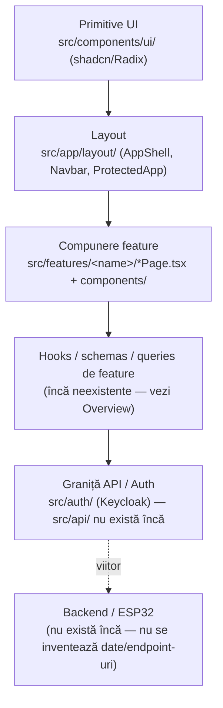

# Straturi ale aplicației

Layering strict, de sus (UI) în jos (rețea, momentan inexistentă):

## Ce înseamnă fiecare strat azi

- **Primitive UI** (`src/components/ui/`) — doar componente shadcn brute (badge, button, card, dropdown-menu, input, label, popover, separator, tabs). Nu se restilizează prin wrapper — vezi [[Shadcn-Primitives]].
- **Layout** (`src/app/layout/`) — `AppShell.tsx` (Navbar + `<Outlet/>`), `Navbar.tsx`, `ProtectedApp.tsx` (`ThemeProvider > AuthProvider > AppShell`). Router-ul propriu-zis e în `src/app/router/AppRouter.tsx` — vezi [[Harta-Rute]].
- **Compunere feature** (`src/features/<name>/`) — fiecare pagină orchestrează secțiuni, nu implementează totul inline. Detalii per feature în [[Overview]].
- **Hooks/schemas/queries de feature** — target arhitectural din `AGENTS_SERA.md`, dar **neexistent încă**: nu există `useQuery`/`useMutation` nicăieri în `src`, deși `QueryClientProvider` e deja montat global (`src/app/providers/`).
- **Graniță API/Auth** — `src/auth/` e singura sursă de adevăr pentru identitate/sesiune (vezi [[Keycloak]]). `src/api/` (client HTTP + funcții per feature) încă nu există — fază UI-only, nu se inventează endpoint-uri.

Legături: [[Reguli-Ownership]] · [[Stack-Tehnologii]] · [[00-Index]]
