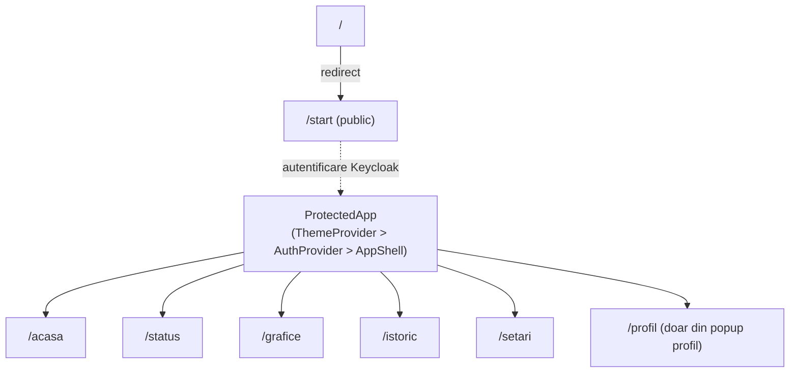

# Harta de rute

Definite în `src/app/router/AppRouter.tsx` (React Router v7, `BrowserRouter`).

| Cale | Componentă | Protejat? | Note |
|---|---|---|---|
| `/` | `Navigate to="/start"` | Nu | redirect |
| `/start` | [[Start]] (`src/features/start/StartPage.tsx`) | Nu | landing/splash public, cu particule |
| `/acasa` | [[Home]] (`src/features/home/HomePage.tsx`) | Da | `AGENTS_SERA.md` numește conceptual ruta `/`, dar în cod e `/acasa` |
| `/status` | [[Status]] (`src/features/status/StatusPage.tsx`) | Da | |
| `/grafice` | [[Charts]] (`src/features/charts/ChartsPage.tsx`) | Da | |
| `/istoric` | [[History]] (`src/features/history/HistoryPage.tsx`) | Da | |
| `/setari` | [[Settings]] (`src/features/settings/SettingsPage.tsx`) | Da | |
| `/profil` | [[Profile]] (`src/features/profile/ProfilePage.tsx`) | Da | accesibilă doar din popup-ul de profil, nu din navbar |

## Diagramă

`ProtectedApp` (`src/app/layout/ProtectedApp.tsx`) e ruta-wrapper pentru toate rutele autentificate; `AuthProvider` blochează randarea până la autentificare Keycloak — vezi [[Keycloak]]. `AppShell` randează `Navbar` + `<Outlet/>`; `Navbar.tsx` hard-codează cele 4 linkuri centrale (STATUS/GRAFICE/ISTORIC/SETĂRI), logo-ul leagă spre `/acasa`, iar dreapta conține `ThemePopover` ([[Theme]]) și `ProfileMenu` ([[Profile]]).

Legături: [[Overview]] · [[00-Index]]
